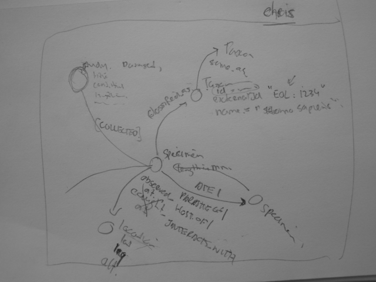

# GloBI Issues

GitHub help facilitate open source development through git, a distributed revision control system. 

Aside from version control through git repositories, GitHub offers issue tracking. 

This repository keeps track of issues for Global Biotic Interactions (GloBI), a project that helps facilitate access to dataset that describe how organisms interact. The aim of this repository is to keep track of GloBI related communication by making them available through ... a git repository. 

## Methods 

The github issues and their associated attachments are tracked by periodically executing the following command 

```bash
# optionally set token to increase api limits. 
export GITHUB_TOKEN=[your personal github token] 

# track the issues
preston track https://github.com/globalbioticinteractions/globalbioticinteractions/issues
```

## Results 

After tracking the issues, each issue and their associated comment is available in json format. 

The example below prints the content associated with [issue #1](https://github.com/globalbioticinteractions/globalbioticinteractions/issues/1) of [Global Biotic Interactions](https://github.com/globalbioticinteractions/globalbioticinteractions) using preston, grep and jq.

```
preston head \
 | preston cat \
 | grep hasVersion \
 | grep -E "https://api.github.com/repos/.*/issues/1[^0-9]"
 | preston cat 
```

yielding the following result retrieved from 

```
<https://api.github.com/repos/globalbioticinteractions/globalbioticinteractions/issues/1> <http://purl.org/pav/hasVersion> <hash://sha256/ed70e77fc798c1013bf7509221ca080006cf61a22e519a369303d11ab077bfd7> <urn:uuid:2554b92a-b47f-4fc1-8e2e-55b3b58dca45> .
<https://api.github.com/repos/globalbioticinteractions/globalbioticinteractions/issues/1/comments?per_page=100> <http://purl.org/pav/hasVersion> <hash://sha256/395d6b6a964cc1e2f03287e088171c7e4b7808f38864459016272aefea9e0076> <urn:uuid:a83ed26b-1a48-49d3-97eb-d556db8c054b> .
```

Note that associated image attached to [issue #1](https://github.com/globalbioticinteractions/globalbioticinteractions/issues/1) at  was also tracked as seen via 

```
preston head \
 | preston cat \
 | grep hasVersion \
 | grep "https://f.cloud.github.com/assets/1084872/215133/58c0882e-8468-11e2-9765-5a0b366ffc78.png"
```

```
<https://f.cloud.github.com/assets/1084872/215133/58c0882e-8468-11e2-9765-5a0b366ffc78.png> <http://purl.org/pav/hasVersion> <hash://sha256/65ddcef75a93746df074b45a6794cea7d7e586445816f11f9f759ef535fd1260> <urn:uuid:07ea2867-b2a4-4a01-979c-0e2494aa8a98> .
```


```
{
  "url": "https://api.github.com/repos/globalbioticinteractions/globalbioticinteractions/issues/1",
  "repository_url": "https://api.github.com/repos/globalbioticinteractions/globalbioticinteractions",
  "labels_url": "https://api.github.com/repos/globalbioticinteractions/globalbioticinteractions/issues/1/labels{/name}",
  "comments_url": "https://api.github.com/repos/globalbioticinteractions/globalbioticinteractions/issues/1/comments",
  "events_url": "https://api.github.com/repos/globalbioticinteractions/globalbioticinteractions/issues/1/events",
  "html_url": "https://github.com/globalbioticinteractions/globalbioticinteractions/issues/1",
  "id": 11601494,
  "node_id": "MDU6SXNzdWUxMTYwMTQ5NA==",
  "number": 1,
  "title": "Review existing data model",
  "user": {
    "login": "jhpoelen",
    "id": 1084872,
    "node_id": "MDQ6VXNlcjEwODQ4NzI=",
    "avatar_url": "https://avatars.githubusercontent.com/u/1084872?v=4",
    "gravatar_id": "",
    "url": "https://api.github.com/users/jhpoelen",
    "html_url": "https://github.com/jhpoelen",
    "followers_url": "https://api.github.com/users/jhpoelen/followers",
    "following_url": "https://api.github.com/users/jhpoelen/following{/other_user}",
    "gists_url": "https://api.github.com/users/jhpoelen/gists{/gist_id}",
    "starred_url": "https://api.github.com/users/jhpoelen/starred{/owner}{/repo}",
    "subscriptions_url": "https://api.github.com/users/jhpoelen/subscriptions",
    "organizations_url": "https://api.github.com/users/jhpoelen/orgs",
    "repos_url": "https://api.github.com/users/jhpoelen/repos",
    "events_url": "https://api.github.com/users/jhpoelen/events{/privacy}",
    "received_events_url": "https://api.github.com/users/jhpoelen/received_events",
    "type": "User",
    "user_view_type": "public",
    "site_admin": false
  },
  "labels": [],
  "state": "closed",
  "locked": false,
  "assignee": {
    "login": "cmungall",
    "id": 50745,
    "node_id": "MDQ6VXNlcjUwNzQ1",
    "avatar_url": "https://avatars.githubusercontent.com/u/50745?v=4",
    "gravatar_id": "",
    "url": "https://api.github.com/users/cmungall",
    "html_url": "https://github.com/cmungall",
    "followers_url": "https://api.github.com/users/cmungall/followers",
    "following_url": "https://api.github.com/users/cmungall/following{/other_user}",
    "gists_url": "https://api.github.com/users/cmungall/gists{/gist_id}",
    "starred_url": "https://api.github.com/users/cmungall/starred{/owner}{/repo}",
    "subscriptions_url": "https://api.github.com/users/cmungall/subscriptions",
    "organizations_url": "https://api.github.com/users/cmungall/orgs",
    "repos_url": "https://api.github.com/users/cmungall/repos",
    "events_url": "https://api.github.com/users/cmungall/events{/privacy}",
    "received_events_url": "https://api.github.com/users/cmungall/received_events",
    "type": "User",
    "user_view_type": "public",
    "site_admin": false
  },
  "assignees": [
    {
      "login": "cmungall",
      "id": 50745,
      "node_id": "MDQ6VXNlcjUwNzQ1",
      "avatar_url": "https://avatars.githubusercontent.com/u/50745?v=4",
      "gravatar_id": "",
      "url": "https://api.github.com/users/cmungall",
      "html_url": "https://github.com/cmungall",
      "followers_url": "https://api.github.com/users/cmungall/followers",
      "following_url": "https://api.github.com/users/cmungall/following{/other_user}",
      "gists_url": "https://api.github.com/users/cmungall/gists{/gist_id}",
      "starred_url": "https://api.github.com/users/cmungall/starred{/owner}{/repo}",
      "subscriptions_url": "https://api.github.com/users/cmungall/subscriptions",
      "organizations_url": "https://api.github.com/users/cmungall/orgs",
      "repos_url": "https://api.github.com/users/cmungall/repos",
      "events_url": "https://api.github.com/users/cmungall/events{/privacy}",
      "received_events_url": "https://api.github.com/users/cmungall/received_events",
      "type": "User",
      "user_view_type": "public",
      "site_admin": false
    }
  ],
  "milestone": null,
  "comments": 1,
  "created_at": "2013-03-04T01:06:50Z",
  "updated_at": "2013-05-14T18:34:03Z",
  "closed_at": "2013-05-14T18:34:03Z",
  "author_association": "MEMBER",
  "type": null,
  "active_lock_reason": null,
  "sub_issues_summary": {
    "total": 0,
    "completed": 0,
    "percent_completed": 0
  },
  "issue_dependencies_summary": {
    "blocked_by": 0,
    "total_blocked_by": 0,
    "blocking": 0,
    "total_blocking": 0
  },
  "body": "See attached image for a coarse description of the existing species interaction data model.  \n\nPossible improvements include: interaction type modeling (directionality, type hierarchy, interaction type \"taxonomy\"), taxon classification modeling, attribution, study vs dataset vs summary.\n\n\n",
  "closed_by": {
    "login": "jhpoelen",
    "id": 1084872,
    "node_id": "MDQ6VXNlcjEwODQ4NzI=",
    "avatar_url": "https://avatars.githubusercontent.com/u/1084872?v=4",
    "gravatar_id": "",
    "url": "https://api.github.com/users/jhpoelen",
    "html_url": "https://github.com/jhpoelen",
    "followers_url": "https://api.github.com/users/jhpoelen/followers",
    "following_url": "https://api.github.com/users/jhpoelen/following{/other_user}",
    "gists_url": "https://api.github.com/users/jhpoelen/gists{/gist_id}",
    "starred_url": "https://api.github.com/users/jhpoelen/starred{/owner}{/repo}",
    "subscriptions_url": "https://api.github.com/users/jhpoelen/subscriptions",
    "organizations_url": "https://api.github.com/users/jhpoelen/orgs",
    "repos_url": "https://api.github.com/users/jhpoelen/repos",
    "events_url": "https://api.github.com/users/jhpoelen/events{/privacy}",
    "received_events_url": "https://api.github.com/users/jhpoelen/received_events",
    "type": "User",
    "user_view_type": "public",
    "site_admin": false
  },
  "reactions": {
    "url": "https://api.github.com/repos/globalbioticinteractions/globalbioticinteractions/issues/1/reactions",
    "total_count": 0,
    "+1": 0,
    "-1": 0,
    "laugh": 0,
    "hooray": 0,
    "confused": 0,
    "heart": 0,
    "rocket": 0,
    "eyes": 0
  },
  "timeline_url": "https://api.github.com/repos/globalbioticinteractions/globalbioticinteractions/issues/1/timeline",
  "performed_via_github_app": null,
  "state_reason": "completed"
}
[
  {
    "url": "https://api.github.com/repos/globalbioticinteractions/globalbioticinteractions/issues/comments/17895835",
    "html_url": "https://github.com/globalbioticinteractions/globalbioticinteractions/issues/1#issuecomment-17895835",
    "issue_url": "https://api.github.com/repos/globalbioticinteractions/globalbioticinteractions/issues/1",
    "id": 17895835,
    "node_id": "MDEyOklzc3VlQ29tbWVudDE3ODk1ODM1",
    "user": {
      "login": "jhpoelen",
      "id": 1084872,
      "node_id": "MDQ6VXNlcjEwODQ4NzI=",
      "avatar_url": "https://avatars.githubusercontent.com/u/1084872?v=4",
      "gravatar_id": "",
      "url": "https://api.github.com/users/jhpoelen",
      "html_url": "https://github.com/jhpoelen",
      "followers_url": "https://api.github.com/users/jhpoelen/followers",
      "following_url": "https://api.github.com/users/jhpoelen/following{/other_user}",
      "gists_url": "https://api.github.com/users/jhpoelen/gists{/gist_id}",
      "starred_url": "https://api.github.com/users/jhpoelen/starred{/owner}{/repo}",
      "subscriptions_url": "https://api.github.com/users/jhpoelen/subscriptions",
      "organizations_url": "https://api.github.com/users/jhpoelen/orgs",
      "repos_url": "https://api.github.com/users/jhpoelen/repos",
      "events_url": "https://api.github.com/users/jhpoelen/events{/privacy}",
      "received_events_url": "https://api.github.com/users/jhpoelen/received_events",
      "type": "User",
      "user_view_type": "public",
      "site_admin": false
    },
    "created_at": "2013-05-14T18:34:03Z",
    "updated_at": "2013-05-14T18:34:03Z",
    "body": "Closed issue and replaced with more specific issue #5 .\n",
    "author_association": "MEMBER",
    "reactions": {
      "url": "https://api.github.com/repos/globalbioticinteractions/globalbioticinteractions/issues/comments/17895835/reactions",
      "total_count": 0,
      "+1": 0,
      "-1": 0,
      "laugh": 0,
      "hooray": 0,
      "confused": 0,
      "heart": 0,
      "rocket": 0,
      "eyes": 0
    },
    "performed_via_github_app": null
  }
]
```

## Discussion

By tracking GitHub issues and versioning their content, we can now access issues without being constrained by GitHub API rate limits. Also, the associated content can now be accessed and processed outside the GitHub platform without putting pressure on the GitHub API services.
 

